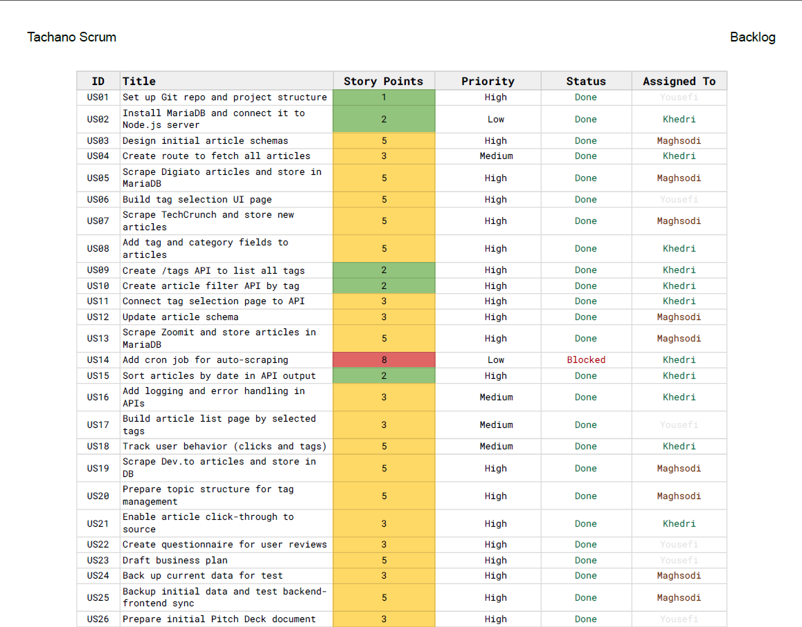
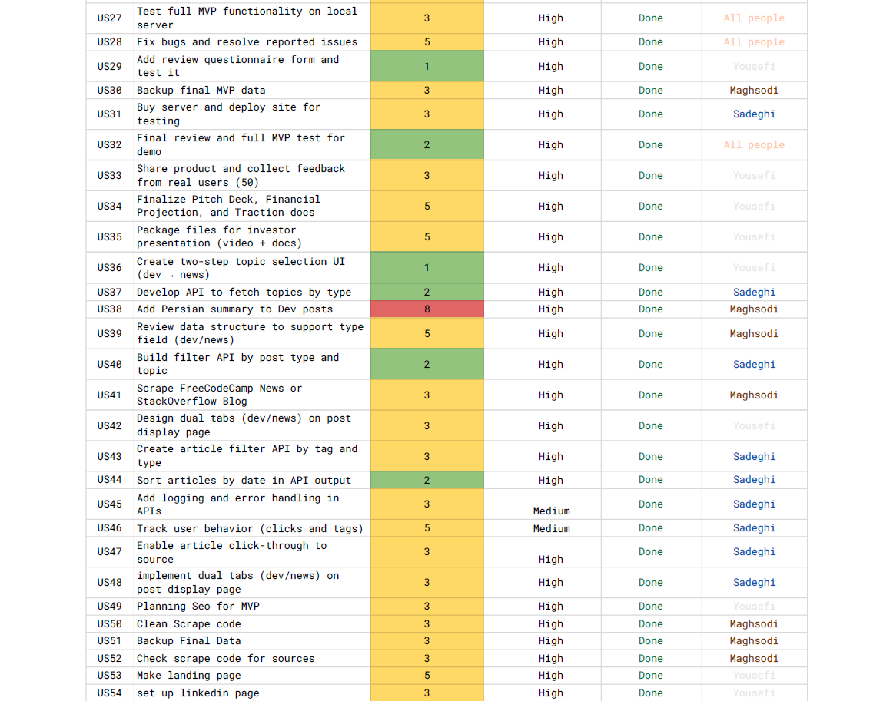
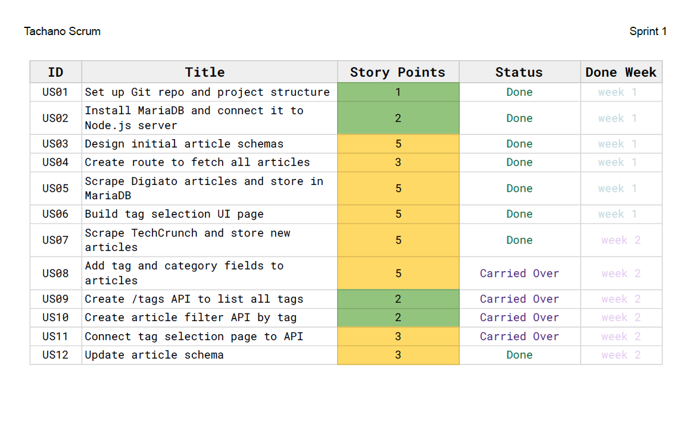
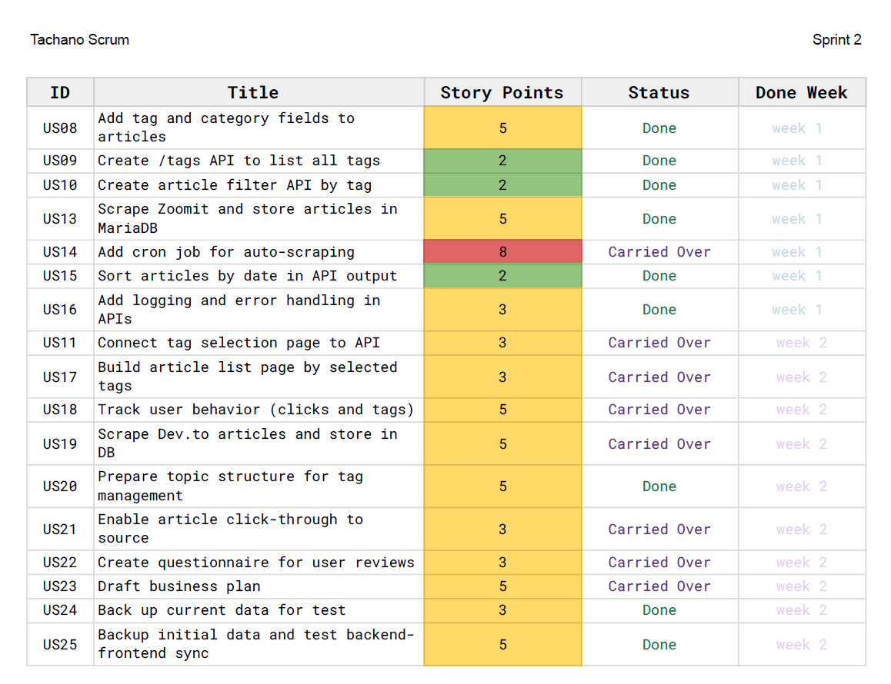
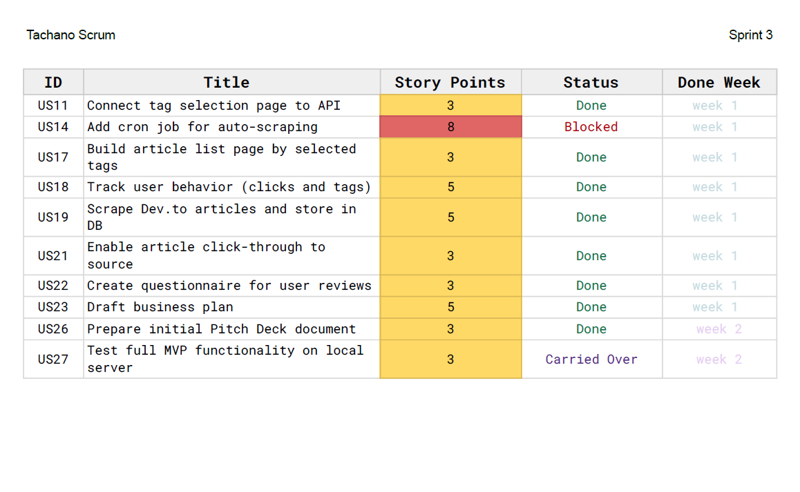
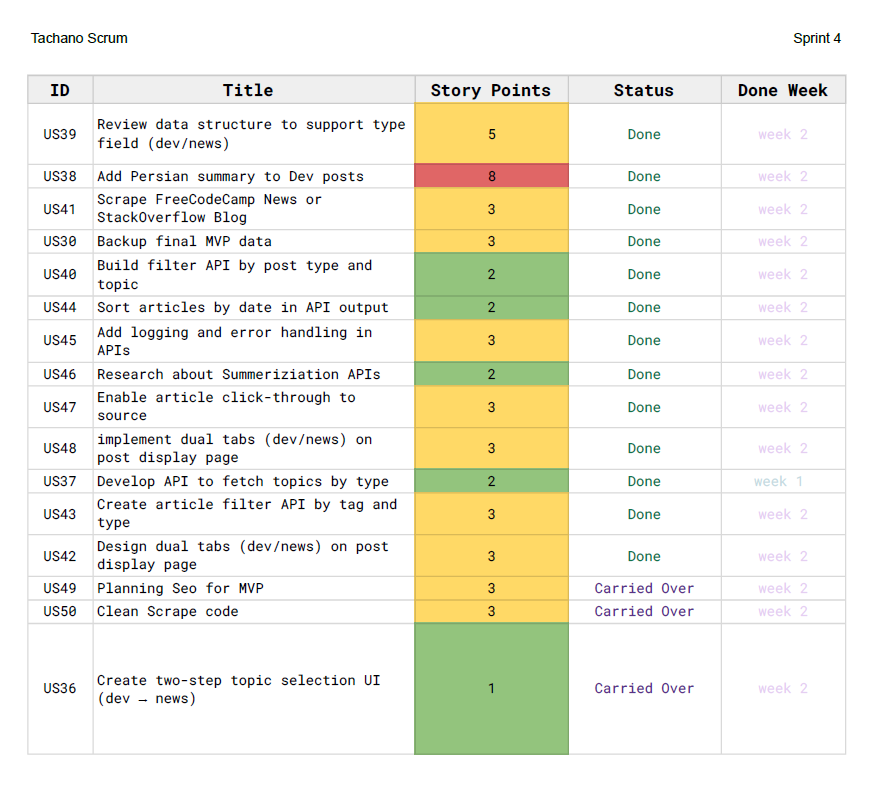
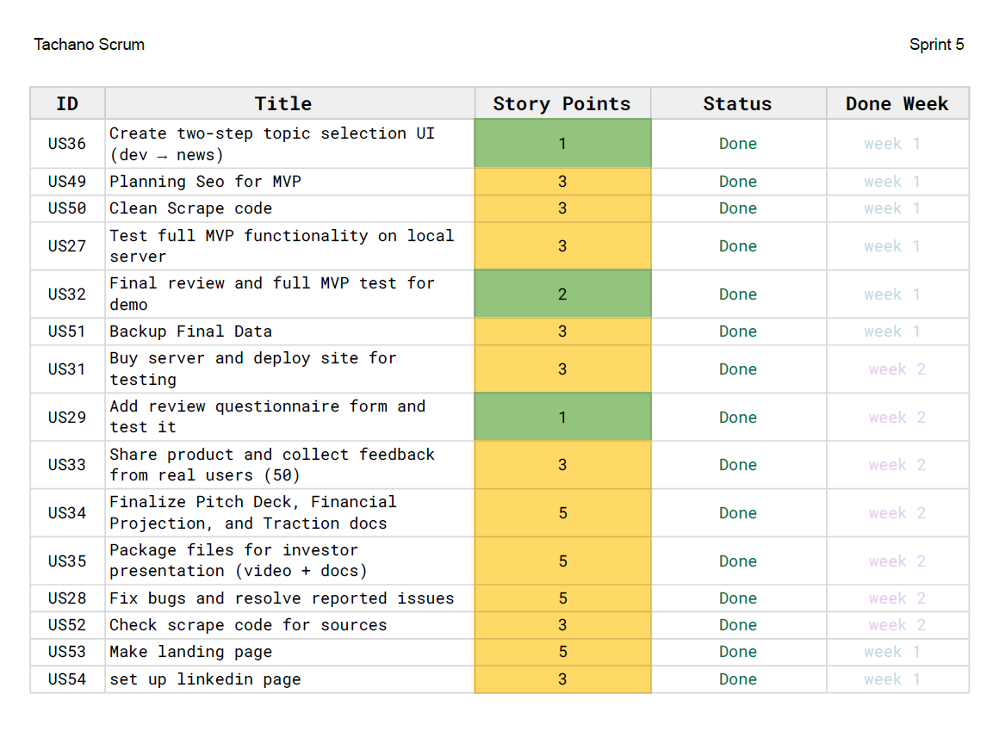
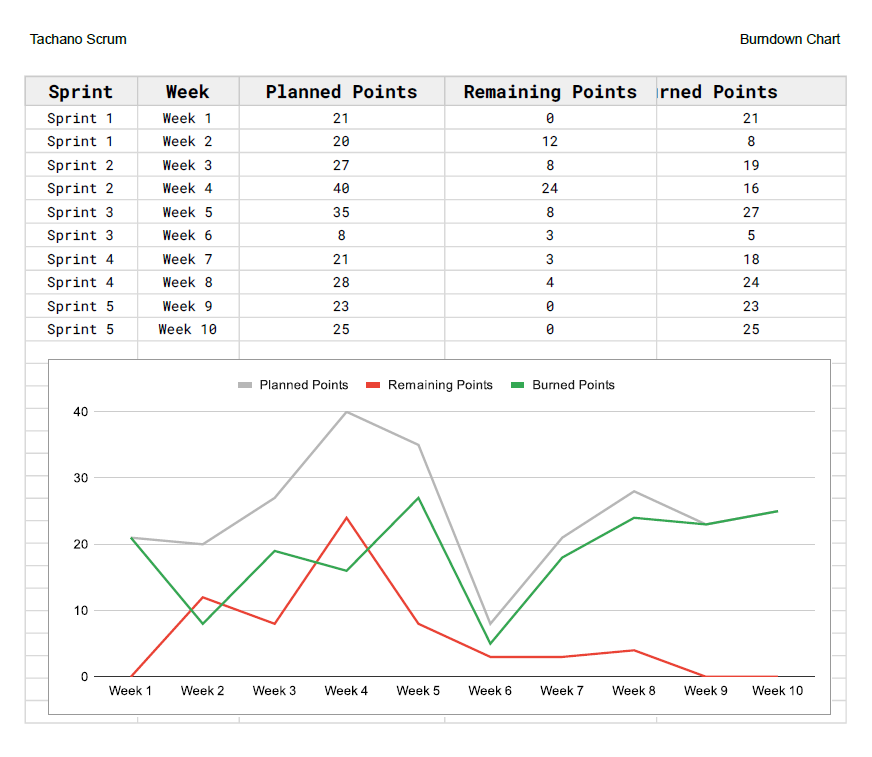

# 🚀 Startup Scrum Documentation

This repository contains the Scrum documentation of my startup project during its initial testing phase (MVP).  
The project was managed and executed over **5 sprints** using the Agile Scrum framework.  
The main outcome was launching a **website MVP** to test the market and gather real user feedback.  

---

## 📌 Project Overview
- **Team size:** 3 members  
- **Methodology:** Agile (Scrum – 5 Sprints)  
- **Tools:** Google Sheets  
- **Deliverable:** MVP website for market testing  
- **User feedback:** Collected from 50+ early users  

---

## 📂 Project Documentation

### Product Backlog

  
  

[📄 View PDF](TachanoScrum-Backlog.pdf)

---

### Sprint 1

  

[📄 View PDF](TachanoScrum-Sprint1.pdf)

### Sprint 2

  

[📄 View PDF](TachanoScrum-Sprint2.pdf)

### Sprint 3

  

[📄 View PDF](TachanoScrum-Sprint3.pdf)

### Sprint 4

  

[📄 View PDF](TachanoScrum-Sprint4.pdf)

### Sprint 5

  

[📄 View PDF](TachanoScrum-Sprint5.pdf)

---

### Burndown Chart

  

[📄 View PDF](TachanoScrum-Burndown.pdf)

---

## 🎯 Skills Demonstrated
- **Project Management**  
- **Agile & Scrum Framework**  
- **Team Leadership & Coordination**  
- **Sprint Planning & Backlog Management**  
- **MVP Development**  
- **User Feedback Collection & Analysis**  

---

## 🔗 About the Project
This project represents my hands-on experience in **project management and startup execution**.  
The goal was to **rapidly launch an MVP**, manage the team across **5 sprints**, and collect real user feedback to guide further product development.
